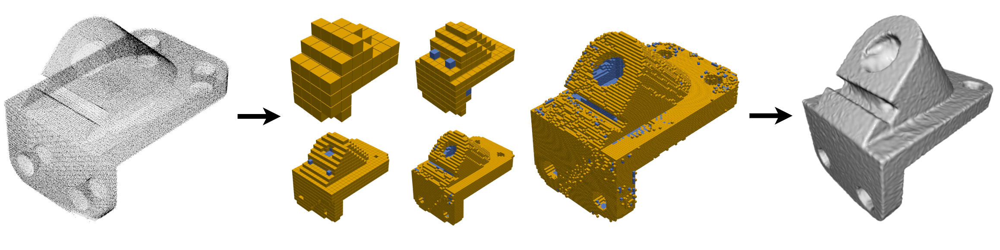

Octree Guided Unoriented Surface Reconstruction (CVPR 2023)
---
Created by [Chamin Hewa Koneputugodage]( https://www.linkedin.com/in/chamin-hewa-koneputugodage-b3ba17148/), [Yizhak Ben-Shabat (Itzik)](http://www.itzikbs.com) and [Stephen Gould](http://users.cecs.anu.edu.au/~sgould/) from [ANU](https://www.anu.edu.au/) and [Technion](https://www.technion.ac.il/).

__[Project page](https://chumbyte.github.io/OG-INR-Site/)&nbsp;/ [Paper](https://openreview.net/pdf?id=jSuYeWKw2Z)&nbsp;/ [Video](https://www.youtube.com/watch?v=Kh4Qohl2Zr8&ab_channel=anucvml)__

<div align="center">
  <a href="https://www.itzikbs.com/" target="blank">
    
  </a>
  <a href="https://www.linkedin.com/in/chamin-hewa-koneputugodage-b3ba17148/" target="blank">
    
  </a>
  <a href="https://cecs.anu.edu.au/people/stephen-gould/" target="blank">
    
  </a>
</div>



## Introduction
This is the code for OG-INR (Octree-Guided Implicit Neural Representations).

Please follow the installation instructions below.

## Instructions

### 1. Requirements

Our codebase uses [PyTorch](https://pytorch.org/).

The code was tested with Python 3.7.9, torch 1.9.0, CUDA 11.3 on Ubuntu 18.04 (should work with later versions).
For a full list of requirements see [the `requirement.txt` file](requirements.txt). Note we also use `plotly-orca` for visualisation, which needs to be installed from conda.

Example installation code (should install PyTorch separately):
```sh
conda create -n oginr python=3.7.9
conda activate oginr
conda install pip # for using pip commands in the conda env
pip install -r requirements.txt

pip install torch==1.11.0+cu113 torchvision==0.12.0+cu113 torchaudio==0.11.0 --extra-index-url https://download.pytorch.org/whl/cu113
```

### 2. Build Octree Code

```sh
cd octree_base
python setup.py build_ext --inplace
```

### 3. Surface Reconstruction (and Scene Reconstruction)
#### 3.1 Data for Surface Reconstruction
##### 3.1.1 Surface Reconstruction Benchamark data
The Surface Reconstruction Benchmark (SRB) data is provided in the [Deep Geometric Prior repository](https://github.com/fwilliams/deep-geometric-prior).
This can be downloaded via terminal into the data directory by running `data/scripts/download_srb.sh` (1.12GB download). We use the entire dataset (of 5 complex shapes).

If you use this data in your research, make sure to cite the Deep Geometric Prior paper.

##### 3.1.2 ShapeNet data
We use a subset of the [ShapeNet](https://shapenet.org/) data as chosen by [Neural Splines](https://github.com/fwilliams/neural-splines). This data is first preprocessed to be watertight as per the pipeline in the [Occupancy Networks repository](https://github.com/autonomousvision/occupancy_networks), who provide both the pipleline and the entire preprocessed dataset (73.4GB). 

The Neural Spline split uses the first 20 shapes from the test set of 13 shape classes from ShapeNet. We provide [a subset of the ShapeNet preprocessed data](https://drive.google.com/file/d/1h6TFHnza0axOZz5AuRkfyLMx_sFcu_Yf/view?usp=sharing) (the subset that corresponds to the split of Neural Splines) and [the resulting point clouds for that subset](https://drive.google.com/file/d/14CW_a0gS3ARJsIonyqPc5eKT3iVcCWZ0/view?usp=sharing). These can be downloaded via terminal into the data directory by running `data/scripts/download_shapenet.sh`  (783.76MB download).

If you use this data in your research, make sure to cite the ShapeNet and Occupancy Network papers, and if you report on this split, compare and cite to the Neural Spline paper.

#### 3.2 Running Surface Reconstruction
To train, test and evaluate on SRB run 

```./scripts/srb.sh```

Similarly we provide a script for ShapeNet: 

```./scripts/shapenet.sh```

These scripts have bash variables for changing the input, major hyperparameters, and where saves/logs/meshes are made.

## Thanks

This project has received funding from the European Union's Horizon 2020 research and innovation
programme under the Marie Sklodowska-Curie grant agreement No 893465.

## License and Citation

If you find our work useful in your research, please cite our paper:

[Preprint](http://arxiv.org/abs/2106.10811):
```bibtex
@inproceedings{koneputugodage2023octree,
        title={Octree Guided Unoriented Surface Reconstruction},
        author={Koneputugodage, Chamin Hewa and Ben-Shabat, Yizhak and Gould, Stephen},
        booktitle={Proceedings of the IEEE/CVF Conference on Computer Vision and Pattern Recognition},
        pages={16717--16726},
        year={2023}
      }
```

See [LICENSE](LICENSE) file.